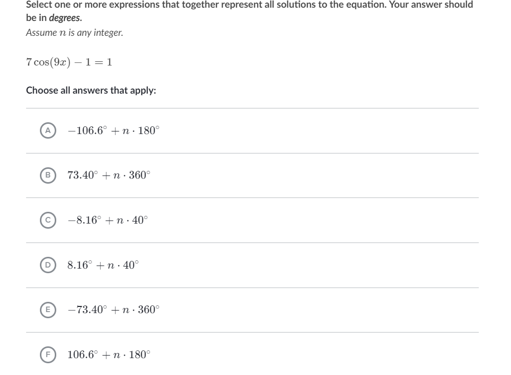
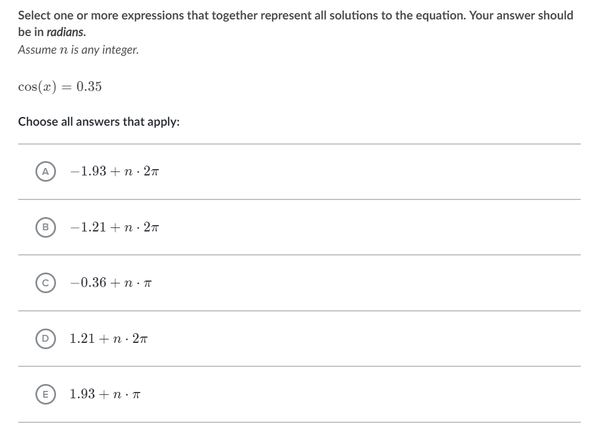
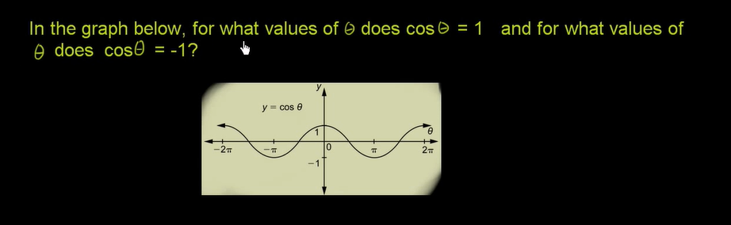
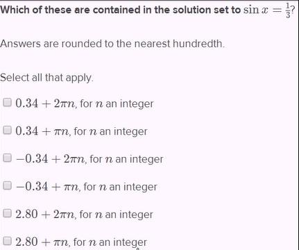
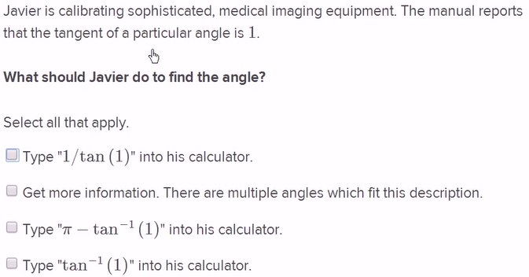
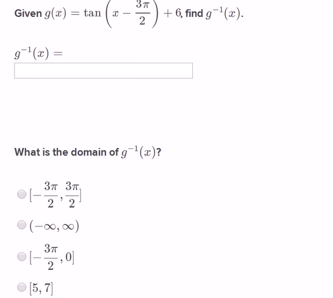
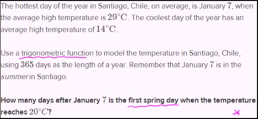
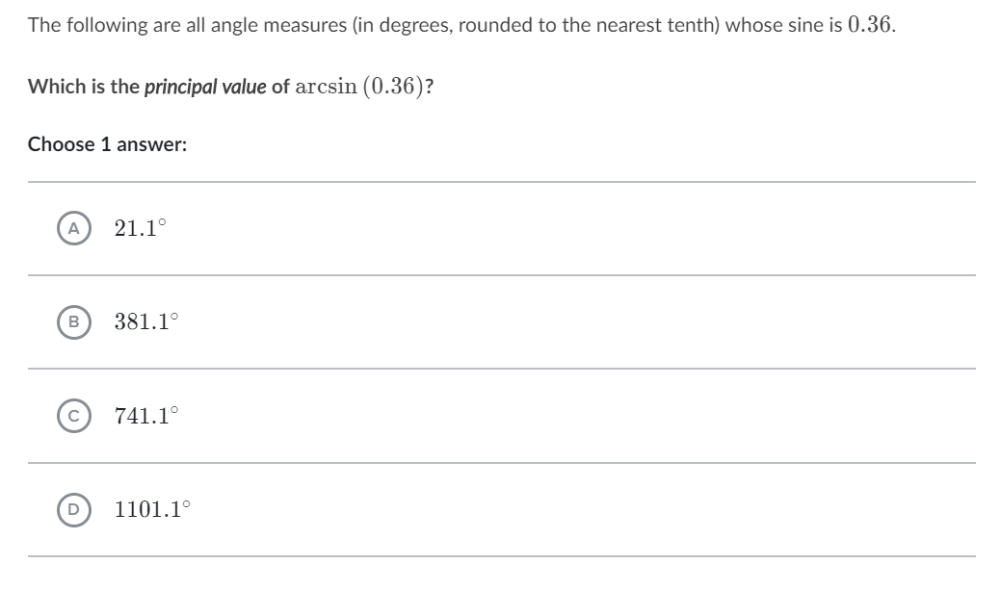
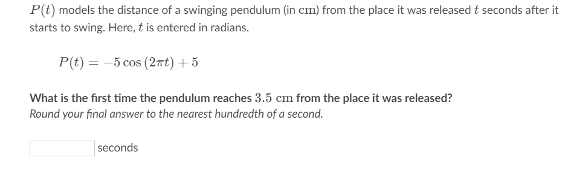
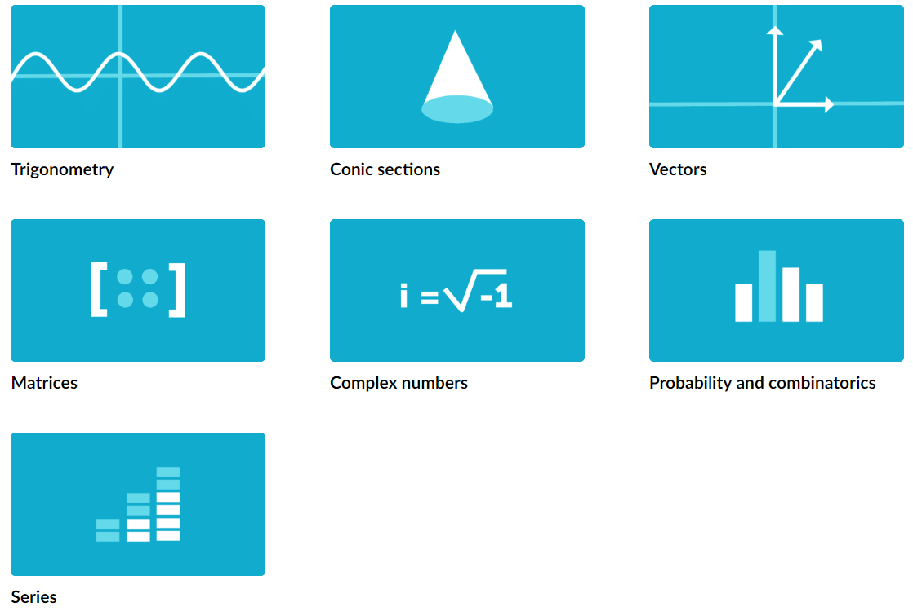

# Homework of Course 1
 

## Translation of terminology

- adjacent side
- hypoteuse
- opposite side
- radian
- inverse function
- axis
- coordinate
- invertible
- domain
- range
## questions
1.  
 

2.  
 

3.  
 

4.  
 

5.  
 
6.  
 
7.  
 
8.  
 
9.  
 
10.  
 
11.  
 
